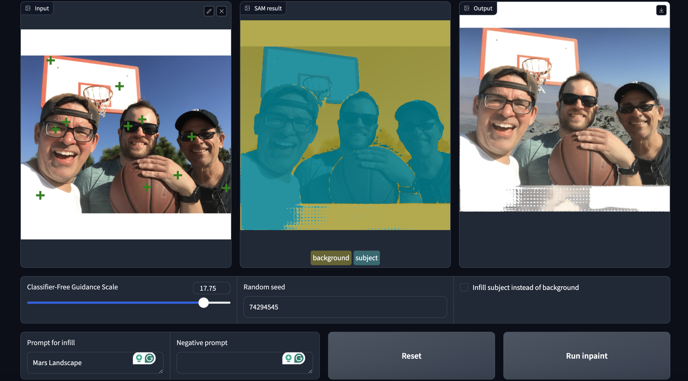

# Image Segmentation Inpainting 
This Udacity project demonstrates how to build a web application that enables users to replace the background of an image with one generated by Stable Diffusion through text prompts. The notebook walks through loading models, processing inputs, generating segmentation masks, and using diffusion pipelines to create seamless background swaps.

## Overview

This project explores:
- **Image Segmentation:** Identifying and isolating specific subjects in an image.
- **Text-to-Image Generation:** Creating new visual content based on descriptive text prompts.
- **Image Inpainting:** Replacing selected regions of an image while maintaining natural integration.

The notebook (photo-editor.ipynd) combines tools from state-of-the-art models to achieve these goals, showcasing a practical pipeline for creative applications.

---

## Key Concepts and Methodology

1. **Image Segmentation**
   - The project uses a pre-trained segmentation model to separate the subject from the background of an image. This segmentation allows precise control over which portions of the image are modified.

2. **AI-Powered Background Replacement**
   - Using text-based prompts, the application generates new backgrounds that align with user-specified descriptions. The pipeline ensures that these new backgrounds integrate smoothly with the segmented subject.

3. **Image Processing Pipeline**
   - A structured pipeline guides the transformation from the original image to the final output. This includes:
     - Preparing images and generating masks.
     - Using AI to generate new image components.
     - Merging results for a polished output.

---

## Application Example Outputs
### Family in the Amazon
#### Original Image

#### App UI

#### Edited Image

### Family on Mars
#### Original Image

#### App UI

#### Edited Image

### Library on Mars
#### Original Image

#### App UI

